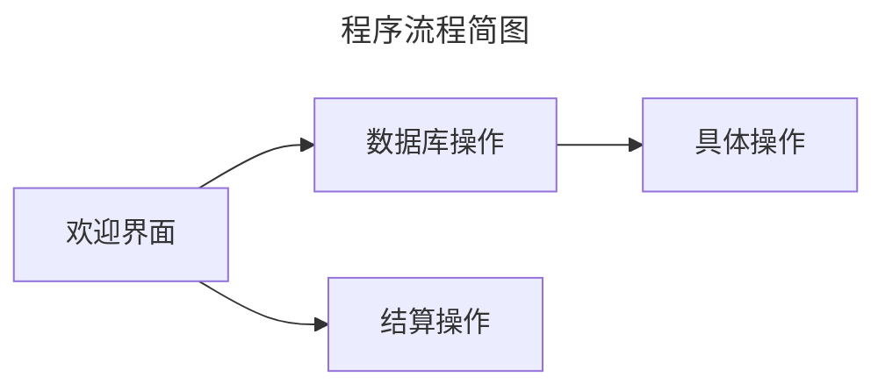
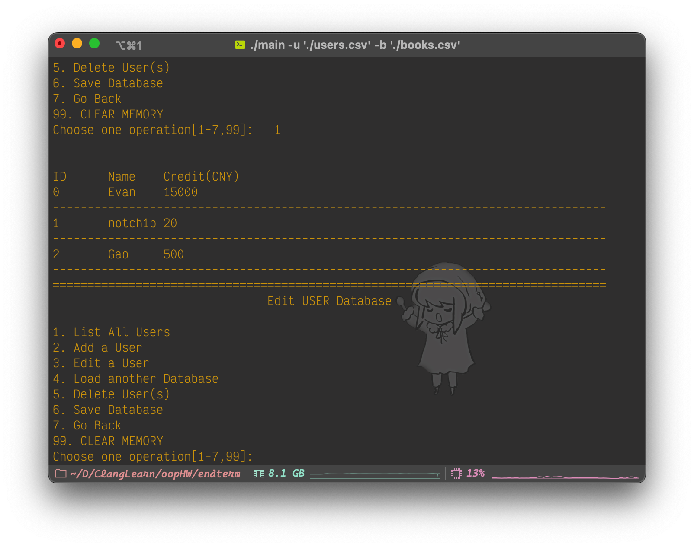
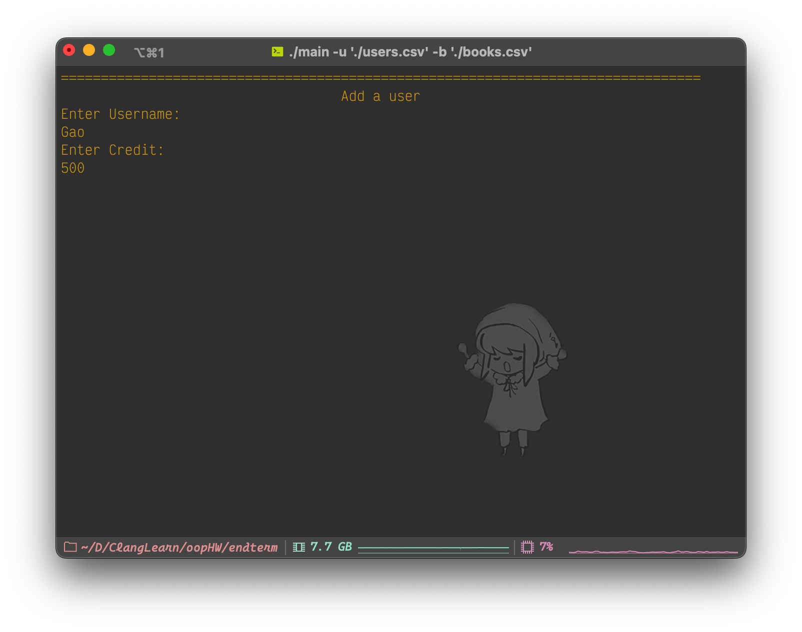
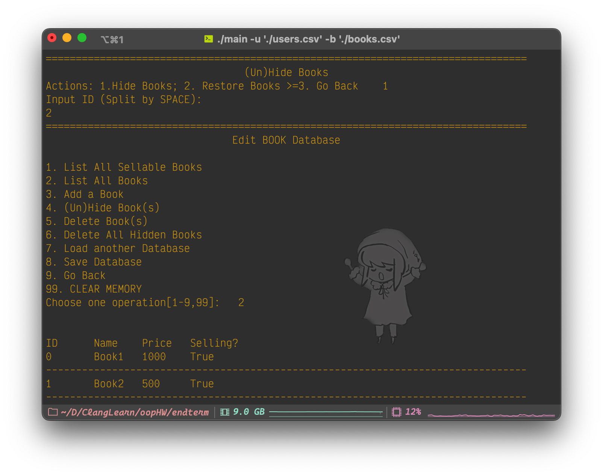
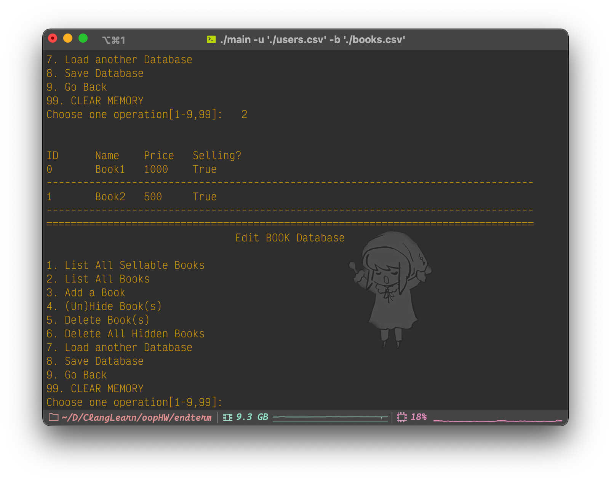
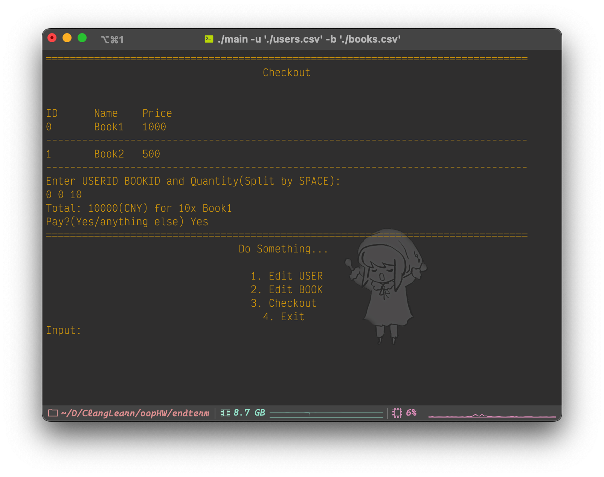
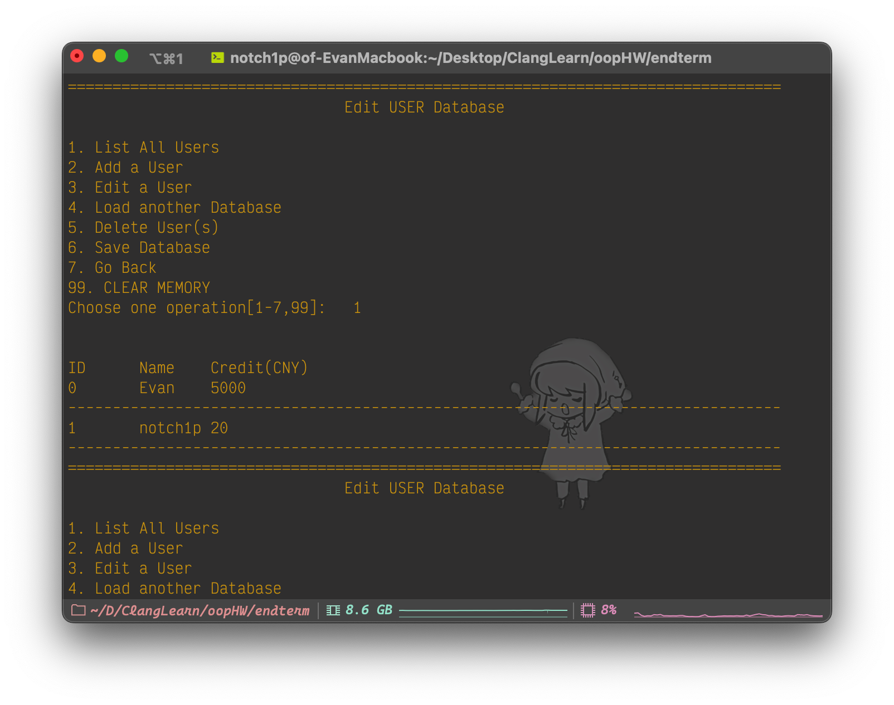

# 实训报告：图书管理系统

<center/><b>[REDACTED]</b>

## 一、需求分析

本程序实现了**图书管理、用户管理、数据库管理、简单结算**的功能。试简单分列如下：

- **图书管理**
  - 图书添加/删除功能
  - 图书信息编辑功能
  - 图书一览功能
  - 图书上/下架功能
- **用户管理**
  - 用户添加/删除功能
  - 用户信息编辑功能
  - 用户一览功能
- **数据库管理**
  - 图书、用户数据库导出/导入功能
    - 图书数据库支持压缩功能
    - 数据库为便于维护的csv格式
    - 数据库添加BOM确保读取时不乱码
- **结算**
  - 书籍购买功能
- **杂项**
  - 通用编码：本程序使用UTF-8编码
    - 在Windows下自动切换编码，提高兼容性
  - 错误检查：检查用户输入操作是否合法
  - 越界检查：避免用户错误输入造成数组越界
  - 命令行参数：方便操作
    - `-h ` `--help`
      - 显示命令帮助
    - `-u` `--user` `{path}`
      - 导入用户数据库
    - `-b` `--book` `{path}`
      - 导入书籍数据库

## 二、文件结构

以下是本实训的文件结构，通过`tree` 生成。 **声明** 以下所列文件之作者都是本人。

```shell
.
├── LICENSE
├── Makefile.am # autoconf脚本
├── Makefile.in
├── README.md
├── aclocal.m4 # autoconf相关
├── assets # md文档使用素材
│   ├── image-20230515000408869.png
│   ├── image-20230515000459499.png
│   ├── image-20230515002112455.png
│   ├── image-20230515002152321.png
│   ├── image-20230515004828789.png
│   ├── image-20230515005009981.png
│   └── uml.drawio.svg #UML图
├── autom4te.cache # automake编译缓存
│   ├── output.0
│   ├── output.1
│   ├── output.2
│   ├── requests
│   ├── traces.0
│   ├── traces.1
│   └── traces.2
├── orig 
│   └── bookstore.cpp # 本实训由此重写而来，都是本人所作
├── build_aux # 存放安装卸载等脚本
│   ├── depcomp
│   ├── install-sh
│   └── missing
├── configure # configure脚本
├── configure.ac # configure源
├── main-darwin-aarch64 # macOS下编译得到的二进制文件， arm64
├── main-linux-amd64 # linux下编译得到的二进制文件，amd64
├── main-windows-amd64.exe # windows下编译得到的二进制文件，amd64
├── src # 源代码
│   ├── Makefile # make用自动编译脚本，Windows用，其他环境应该用autotool
│   ├── base.hpp # Base类定义和实现
│   ├── book.cpp
│   ├── book.hpp # Book类定义和实现
│   ├── books.csv # Book用测试样例数据库
│   ├── csv.cpp # CSV读写功能定义和实现
│   ├── csv.hpp
│   ├── data.h # Static成员定义
│   ├── database.hpp # Database容器模板库定义和实现
│   ├── database.tpp
│   ├── exec.cpp # 程序主要流程定义和实现
│   ├── exec.hpp
│   ├── interface.cpp # 程序界面依赖库定义和实现
│   ├── interface.hpp
│   ├── main.cpp # 主程序，程序入口代码
│   ├── user.cpp # User类定义和实现
│   ├── user.hpp
│   └── users.csv # User用测试样例数据库
└── report.md # 报告

6 directories, 48 files
```

macOS平台的程序是在本人电脑上编译完成的；Windows平台的程序是在机房电脑编译完成的；Linux平台的程序是在Arch下编译完成的，经过测试都可以正常运行。

### 编译指南

**代码遵守C++17标准，使用autotool构建**

#### 类Unix

使用autotool自动编译

```shell
./configure
make -j${nproc}
```

这将在根目录生成可执行文件`bookstore`.

#### Windows

通过 `src/Makefile` 使用minGW自带的 `minGW-make` 来编译。其中 `make clean`清除所有目标文件；`make clear`清除所有编译文件。

## 三、系统结构略图

<center/>我们用UML图来描述代码结构，如下所示：	（assets文件夹中有pdf版本）


## 四、具体功能介绍及知识点分析

### 具体功能介绍

程序运行的大致流程如下图所示：



菜单层级、具体操作如下：

1. 修改USER数据库

   1. 用户一览
      - 显示用户的ID、姓名、余额 	**注** 程序中所有整数类型为`unsigned long long`亦即`int64`，满足大部分需求。考虑执行速度不采用`int128`
      - 通过`println()`和`<<`实现，前者可以调整输出流对象、是否换行、分隔符，较为方便。
   2. 用户添加
      - 输入用户名称和余额，将其添加在数据库最后，自动分配ID
      - 复杂度 $O(1)$. 采用emplace_back()方式，原地构造对象，不必调用复制或构造函数，较push_back()更快
   3. 用户修改
      - 输入ID修改用户姓名和余额
   4. 载入另一数据库
      - 通过输入路径载入数据库，支持绝对/相对路径两种
      - 数据库载入内存，理论上数据库大小只受内存限制
      - 默认路径为 `./users.csv`
   5. 用户删除
      - 复杂度 $O(kn)$. 删除 $k$ 名用户（输入ID，空格分隔），自动前移其之后所有用户的ID。
   6. 保存数据库
      - 添加BOM并导出，避免诸如excel等程序显示乱码
      - 默认路径为 `./users.csv`
   7. 返回上级菜单
   8. 清空数据库
      - 复杂度 $O(n)$. 实质上相当于创建新USER数据库

2. 修改BOOK数据库

   1. 上架书一览

      - 显示书籍ID、书名、价格

      - 只列出所有上架（即对象属性的`_isEnabled`为真的）书籍
      - 通过`println()`和`<<`实现，前者可以调整输出流对象、是否换行、分隔符，较为方便。

   2. 所有书一览

      - 显示书籍ID、书名、价格、贩卖状态
      - 列出全部书籍，方便管理者得知各书的贩卖状态

   3. 书籍添加

      - 输入书籍和余额，将其添加在数据库最后，自动分配ID，默认设置为上架
      - 复杂度和具体实现同上

   4. 上/下架书籍

      - 输入书籍ID（可多个，空格分隔）设置其上下架状态，更为灵活，贴近日常需求
      - 状态的改变不影响ID
      - 对象属性的`_isEnabled`存储这一信息。

   5. 书籍删除

   6. 所有下架书籍删除

      - 复杂度 $O(2n)$ . 将所有下架书籍全数删除，缩小数据库体积

      - 搭配4操作可以实现数据库压缩

   7. 载入另一数据库

      - 默认路径为 `./books.csv`

   8. 保存数据库

      - 默认路径为 `./books.csv`

   9. 返回上级菜单

   10. 清空数据库

3. 结帐

   - 在上述两种数据库加载的情况下，通过ID选择对应用户以及书籍和购买数量来结算

4. 退出程序

此外，程序中多次调用了系统的清屏操作：Windows下(cmd,powershell)是`cls`，Linux和macOS下(ncurses)是`clear`，针对不同平台做了适配。

通过规定输出宽度，可以通过填充空格的方式达到文本置中/置右，且填充数
```math
n(\textup{Space})=\begin{cases}w - l \hspace{7.5mm}\textup{where p = RIGHT}\\
\frac{w - l}{2}\hspace{10mm}\textup{where p = CENTER}\end{cases}
```
其中 $w$ 是输出宽度， $l$ 是字串长度， $p$ 是位置。代码中的`ui::printAt()`用到了 $(1)$ .

### 知识点运用

以下按类列出相对不基础的知识点：

- 函数
  - 内联函数
  - 带默认形参值的函数
  - 函数重载

- 类与对象
  - 类成员的访问控制
  - 移动构造函数
  - 枚举类型

- 数据的共享与保护

  - 命名空间
  - 多文件结构与编译预处理命令
  - 静态成员
  - 友元
  - 数据保护（`const`）

- 指针、数组相关

  - 对象数组
  - 指针传参、引用传参
  - 指针运算
  - 动态内存分配

- 类的继承

- 多态、泛型、metaprogramming

  - 运算符重载
  - 模板
    - 实例化（Instantiate）机制
    - Template Specialization

  - 迭代器
  - Lambda Expression
  - Trailing Return Type
  - 函数对象的参数绑定

- STL、流类库
  - vector string bitset
  - 文件流、字符串流、输入输出流
  - 读写加速（将cin cout的速度提高到scanf printf的水准）

## 五、运行情况与截图

以下是在macOS下通过`make`经由`clang++`编译得到的程序：

```
notch1p in oopHW/EndTerm on  master [⇡!?] took 20.7s
[I] ➜ ./main -u './users.csv' -b './books.csv'
Loaded USER database
Loaded BOOK database
================================================================================
                                Do Something...

                                  1. Edit USER
                                  2. Edit BOOK
                                  3. Checkout
                                    4. Exit
Input:	1
================================================================================
                               Edit USER Database

1. List All Users
2. Add a User
3. Edit a User
4. Load another Database
5. Delete User(s)
6. Save Database
7. Go Back
99. CLEAR MEMORY
Choose one operation[1-7,99]:	1


ID	Name	Credit(CNY)
0	Evan	15000
--------------------------------------------------------------------------------
1	notch1p	20
--------------------------------------------------------------------------------
================================================================================
                               Edit USER Database

1. List All Users
2. Add a User
3. Edit a User
4. Load another Database
5. Delete User(s)
6. Save Database
7. Go Back
99. CLEAR MEMORY
Choose one operation[1-7,99]:2
================================================================================
                                   Add a user
Enter Username:
Gao
Enter Credit:
500
================================================================================
                               Edit USER Database

1. List All Users
2. Add a User
3. Edit a User
4. Load another Database
5. Delete User(s)
6. Save Database
7. Go Back
99. CLEAR MEMORY
Choose one operation[1-7,99]:	1


ID	Name	Credit(CNY)
0	Evan	15000
--------------------------------------------------------------------------------
1	notch1p	20
--------------------------------------------------------------------------------
2	Gao	500
--------------------------------------------------------------------------------
================================================================================
                               Edit USER Database

1. List All Users
2. Add a User
3. Edit a User
4. Load another Database
5. Delete User(s)
6. Save Database
7. Go Back
99. CLEAR MEMORY
Choose one operation[1-7,99]:
```

<span style="float:left" >

</span><span style="float:right"></span>

<center/>从文件加载数据库&用户添加

```
================================================================================
                                 (Un)Hide Books
Actions: 1.Hide Books; 2. Restore Books >=3. Go Back	1
Input ID (Split by SPACE):
2
================================================================================
                               Edit BOOK Database

1. List All Sellable Books
2. List All Books
3. Add a Book
4. (Un)Hide Book(s)
5. Delete Book(s)
6. Delete All Hidden Books
7. Load another Database
8. Save Database
9. Go Back
99. CLEAR MEMORY
Choose one operation[1-9,99]:	2


ID	Name	Price	Selling?
0	Book1	1000	True
--------------------------------------------------------------------------------
1	Book2	500	True
--------------------------------------------------------------------------------
2	Book3	200	False
--------------------------------------------------------------------------------
================================================================================
                               Edit BOOK Database

1. List All Sellable Books
2. List All Books
3. Add a Book
4. (Un)Hide Book(s)
5. Delete Book(s)
6. Delete All Hidden Books
7. Load another Database
8. Save Database
9. Go Back
99. CLEAR MEMORY
Choose one operation[1-9,99]:6
Purged 1 Books
================================================================================
                               Edit BOOK Database

1. List All Sellable Books
2. List All Books
3. Add a Book
4. (Un)Hide Book(s)
5. Delete Book(s)
6. Delete All Hidden Books
7. Load another Database
8. Save Database
9. Go Back
99. CLEAR MEMORY
Choose one operation[1-9,99]:	2


ID	Name	Price	Selling?
0	Book1	1000	True
--------------------------------------------------------------------------------
1	Book2	500	True
--------------------------------------------------------------------------------
================================================================================
                               Edit BOOK Database

1. List All Sellable Books
2. List All Books
3. Add a Book
4. (Un)Hide Book(s)
5. Delete Book(s)
6. Delete All Hidden Books
7. Load another Database
8. Save Database
9. Go Back
99. CLEAR MEMORY
Choose one operation[1-9,99]:
```

<span style="float:left">

</span><span style="float:right"></span>

<center/>书籍下架&下架书籍删除

```
================================================================================
                             Saving Database as...
input path:(enter -1 for default path)
!!use '/' instead of '\' on Windows!!
./books.csv
                                  Save Succeed
================================================================================
                               Edit BOOK Database

1. List All Sellable Books
2. List All Books
3. Add a Book
4. (Un)Hide Book(s)
5. Delete Book(s)
6. Delete All Hidden Books
7. Load another Database
8. Save Database
9. Go Back
99. CLEAR MEMORY
Choose one operation[1-9,99]:
```

<center/>保存数据库

原来的数据库

| ID   | Name  | Price | Selling? |
| ---- | ----- | ----- | -------- |
| 0    | Book1 | 1000  | True     |
| 1    | Book2 | 500   | True     |
| 2    | Book3 | 200   | False    |

保存后的数据库

| ID   | Name  | Price | Selling? |
| ---- | ----- | ----- | -------- |
| 0    | Book1 | 1000  | True     |
| 1    | Book2 | 500   | True     |

```
================================================================================
                                    Checkout


ID	Name	Price
0	Book1	1000
--------------------------------------------------------------------------------
1	Book2	500
--------------------------------------------------------------------------------
Enter USERID BOOKID and Quantity(Split by SPACE):
0 0 10
Total: 10000(CNY) for 10x Book1
Pay?(Yes/anything else)	Yes
================================================================================
                                Do Something...

                                  1. Edit USER
                                  2. Edit BOOK
                                  3. Checkout
                                    4. Exit
Input:	1
================================================================================
                               Edit USER Database

1. List All Users
2. Add a User
3. Edit a User
4. Load another Database
5. Delete User(s)
6. Save Database
7. Go Back
99. CLEAR MEMORY
Choose one operation[1-7,99]:	1


ID	Name	Credit(CNY)
0	Evan	5000
--------------------------------------------------------------------------------
1	notch1p	20
--------------------------------------------------------------------------------
================================================================================
                               Edit USER Database

1. List All Users
2. Add a User
3. Edit a User
4. Load another Database
5. Delete User(s)
6. Save Database
7. Go Back
99. CLEAR MEMORY
Choose one operation[1-7,99]:	
```

<span style="float:left">

</span><span style="float:right"></span>

<center/>结算功能:Evan的余额由15000->5000

